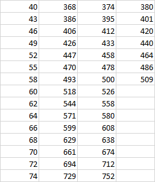

##### [ELVEN KNIGHT](https://l2j.ru/interlude/index.php?p=5&t=2&id=19)

###### Brotherhood of the Goddess - находясь в группе накладывает на всех членов группы эффект дар богини, увеличивающий Gain Heal (+15%) и Heal Effectiveness (+15%), если члены группы Elven, то эффект удваивается.

###### 20

1. Parry - открывает возможность парировать атаки. Игрок получает навык Parry [462] 3 Lv.
2. Daylight Guard - в дневное время суток, P.Atk +[WeaponGrade * 24], M.Def +[AverageArmorGrade * 3.25 * 10],
   M.Def +[AverageArmorGrade * 3.75 * 16]. В ночное время суток параметры снижаются на такие же показатели.
3. Restoring Expertize - позволяет всем исцеляющим заклинаниям усилить свою эффективность на 50%.

###### 30

1. Living Armour - находясь под Ultimate Defense/Vengeance вы можете передвигаться. Талант работает только если
   экипирована тяжелая броня, как только экипировка меняется, вы снова не можете сдвинуться с места. Время перезарядки
   снижается на 50%.
2. Fencer - после парирований позволяет мгновенно контратаковать цель критическим ударом.
3. Abilities Control - снижает потребление МП на все навыки и заклинания на 50%.

##### [TEMPLE KNIGHT](https://l2j.ru/interlude/index.php?p=5&t=2&id=20)

* Summon Storm Cubic - шанс срабатывания 100%, интервал 12 сек.
* Summon Life Cubic - шанс срабатывания 100%, интервал 24 сек.
* Summon Attractive Cubic - шанс срабатывания 100%, интервал 36 сек.
* Holy Aura - Шанс срабатывания 40% -> 70%. @Shift: притягивает всю нежить к вам. Потребляет на 60% больше МП.

###### Undior - при получении урона от навыка или заклинания с элементом WATER позволяет конвертировать его в исцеление HP. Эффект срабатывает не чаще чем раз в 20 сек.

###### 40

1. Panacea - заклинание Poison Recovery/Cure Bleeding превращает урон от яда или кровотечения в регенерацию HP с
   таким же показателем силы исцеления. Разные исцеления - накладывают разные регенерационные эффекты.
2. Elemental Shield - персонаж получает 4 разных навыка, позволяющие видоизменить экипированный щит на
   любой другой с защитой от элементов 100%. Пока навык активен, блокировка физ. атак - щитом, пропадает. Вкл/выкл.
   Потребляет MP в секунду.
3. Counterattack - обучает навыку "Counterattack", который можно использовать только после успешного парирования(с
   шансом
   100%)/блока(с шансом 33%)/уклонения(с шансом 66%). Power: [Fatal Strike reference]. Работает только если у вас
   экипировано оружие ближнего боя Sword/Blunt. Атака может быть критической, от нее нельзя
   уклониться/блокировать/парировать.

###### 50

1. Provoking Balamb - Aura of Hate и Aggression снижают магическую и физическую защиты жертв на 30%.
2. Dashing Sabatons - снимает все эффекты сковывания и замедления, мгновенно увеличивая скорость передвижения на 60 на
   следующие 10 сек. Перезарядка 60 сек. ABILITY.
3. Temple Heal - обучает навыку "Temple Heal" 1 Lv. далее обучение открывается по уровням у тренера. Применяется на
   расстоянии 200. @Shift применение позволяет исцелять группу, увеличивает потребление МП на 100%. Скорость каста
   становится статической, и производится bow (action). Исцеляет с силой (37 Lv.):

   

###### 60

1. Grant of Life - увеличивает даруемое исцеление на 100%.
2. Spell Breaker - ваши атаки физического типа (в ближнем и дальнем бою) сбивают cast заклинаний При успешном
   прерывании, жертва будет оглушена с шансом 50% на 5 сек.
3. Fortress of Resistance - final fortress работает на 60% уровне здоровье и дополнительно увеличивает M.Def. Общая
   эффективность увеличивается на 100%.

###### 70

1. Knight of Cubes - с вероятностью 50% после активации куба у него есть шанс сбросить свой интервал и активироваться
   повторно.
2. Endurance - вы получаете иммунитет против негативного статуса **Stun**.
3. Vitality - не получая урон в течение 15 сек. на вас накладывается эффект восстанавливающий 28 * CONModifier HP в
   секунду, пока ваше здоровье не будет полностью восстановлено. Получив урон - эффект рассеивается.

###### 80

1. Will of Eva - когда на вас накладывают disable эффект, который длиться более 5 сек., через 1 сек. вы вырываетесь из
   него восстанавливая 1039 ед. здоровья. Срабатывает раз в 60 сек.
2. Unity - аура, объединяющая всех членов группы/клана/альянса в радиусе 900. Исходящее и входящее исцеления усиливаются
   на 50%, шанс получить негативный эффект Silence/Sleep/Paralyze/Derangement снижается на 50%. Действует всегда как
   пассивный навык.
3. Soul Enhancement - заряжает следующую атаку SS нужного типа, при этом SS больше не тратятся. Модификатор SS
   удваивается. Потребляет 37 MP и 173 HP.

##### [SWORD SINGER](https://l2j.ru/interlude/index.php?p=5&t=2&id=21)

###### 40

###### 50

###### 60

###### 70

###### 80

1. Ballade: Elven Lied - исполняет эльфийскую песнь, которая исцеляет всех членов альянса/клана/группы в радиусе 900 на
   214.9 HP каждую секунд пока не закончится. Если в радиус попали враги, то их способность к входящему исцелению будет
   снижена на 100%. В один момент времени можно петь только одну балладу.
2. Ballade: Eva. Daughter of the Water - баллада, которая снижает сопротивление против воды у всех врагов в радиусе 900
   на 100% и увеличивает сопротивление против воды у всех союзников на 100%. В один момент времени можно петь только
   одну балладу.
3. Choir - toggle навык (ABILITY) который способен усиливать все Song's и Ballad's в зависимости от кол-ва дружественных
   Sword Singer/Sword Muse персонажей в радиусе 300. Во время использования, проигрывается постоянная анимация каста
   сонгов, но любые действия кроме отключения скила - недоступны. Если в хоре кто-то кастует Song/Ballade, то этот
   эффект усиливается на 20%, а его продолжительность увеличивается на 30 сек. за каждого кто исполняет хор. Постоянно
   потребляет 62 MP.