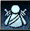

## Двуручная экипировка одноручного оружия

При экипировке одноручного оружия, мы можем задействовать команду  которая позволит при
активации (нажатие на action) экипировать текущее экипированное оружие в ДВЕ руки.

## Экипировка парных клинков

Если у нас экипированно одноручное оружие, то мы можем использовать команду  чтобы экипировать
второе такое же оружие во вторую руку, тем самым - создав парные клинки (и экипировав их)

ПРИ ЭКИПИРОВАНИИ мы должны отменить действие текущего action (одноручный-двуручный)